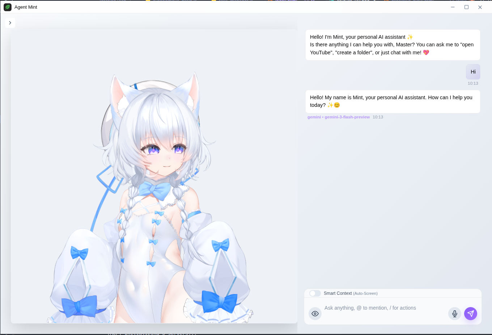

# Mint

<p align="center">
  
</p>

<p align="center">
  <strong>An advanced AI Desktop Companion built for the modern workflow.</strong>
</p>

<p align="center">
  
  
  
  
</p>

---

**Luna Mint** is a powerful AI Desktop Companion built with **Electron** and **Google Gemini**. It seamlessly integrates real-time screen vision, web automation via Puppeteer, local knowledge search, and a modular plugin system to enhance your desktop workflow with a friendly, persona-driven experience.

## ✨ Highlights

- **Persona-Driven**: Features **Mint**, a bubbly, cheerful, and polite assistant.
- **Natural Replies**: Longer AI responses are split into multiple chat bubbles with human-like pacing.
- **Vision-Ready**: Capture and translate any part of your screen in real-time.
- **Automation First**: Control your system and browser via natural language.
- **Advanced Customization**: Create **Custom Themes** with your own background gradients, panel colors, and system text colors.
- **Privacy Conscious**: Local knowledge indexing and customizable data handling.

---

## 📸 Screenshots

<p align="center">
  
  
</p>
<p align="center">
  <em>Main chat interface and personalized settings window</em>
</p>

---

## 🚀 Key Features

### 🧠 Intelligent Core
- **Cute AI Persona (Mint)**: A friendly assistant with a distinct cheerful personality.
- **Multilingual Support**: Detects and responds in multiple languages (English, Thai, etc.) while staying in character.
- **Multi-Bubble Responses**: AI replies can appear in 1–3 short bubbles with a subtle typing delay for a more natural feel.
- **Optimized Chat History**: Sliding window management for consistent performance.
- **Voice-Ready**: Enhanced audio capture with Noise Suppression and Auto Gain Control.
- **Multilingual UI**: The entire settings and main interface is now localized into English and Thai.

### 👁️ Screen Vision & Translation
- **Live Translate**: Drag a box over any window to translate text dynamically.
- **Smart Context**: Periodic screen analysis to provide proactive suggestions based on your work.
- **Pass-through Overlay**: Interact with apps underneath while the translator is active.

### 🛠️ System & Tools
- **App Launcher**: Quick access to binaries, Flatpaks, and Snaps on Linux.
- **Web Automation**: Puppeteer-driven browser control for searching or extracting data.
- **Local Knowledge**: Index and search your `.txt` and `.md` files for quick recall.
- **Plugin Ecosystem**: Dedicated modules for Spotify, Docker, and more.
- **Shortcut Guide**: Built-in keyboard shortcut documentation in the Settings panel.
- **Explicit Quit**: A dedicated "Quit Application" button for complete app termination.

---

## 🚦 Getting Started

### Prerequisites
- [Node.js](https://nodejs.org/) (LTS recommended)
- [npm](https://www.npmjs.com/)
- A **Google Gemini API Key**

### Installation

1. **Clone and Install Dependencies**
   ```bash
   npm install
   ```

2. **Configure Environment**
   Create a `.env` file in the root directory:
   ```env
   GEMINI_API_KEY=your_google_gemini_api_key
   ```
   *Note: You can also set this via the in-app Settings window.*

3. **Launch the Agent**
   ```bash
   npm start
   ```

**Pro Tip:** Use `Ctrl+Shift+Space` as the default global shortcut to summon Mint instantly!

---

## ⚡ Example Commands

Mint understands natural language commands. Try these:

- **Browser**: "Open YouTube" or "Search for the latest AI news"
- **System**: "Open VS Code" or "Create a folder named Projects"
- **Clipboard**: "Copy the text 'Hello World' to my clipboard"
- **Context**: "Remember the file /path/to/notes.md"
- **Utility**: "What's the weather like in Bangkok?"

---

## 🔌 Plugin System

Plugins are located in `src/Plugins/` and can be toggled as needed.

- **Spotify**: Control playback using `playerctl`.
- **Docker**: Manage containers (list/start/stop) directly from chat.
- **Discord**: API integration helpers (experimental).

---

## 🏗️ Project Structure

```text
Mint/
├── assets/           # Images and icons
├── src/
│   ├── AI_Brain/     # Gemini integration & LLM logic
│   ├── Automation/   # Puppeteer and browser scripts
│   ├── Command/      # NLP and command parsing
│   ├── Plugins/      # Spotify, Docker, etc.
│   ├── System/       # Config and state management
│   └── UI/           # Electron renderer and styles
├── main.js           # Main process
└── preload.js        # IPC bridge
```

---

## ⚖️ License

Distributed under the **GNU Affero General Public License v3.0**. See `LICENSE` for more information.
