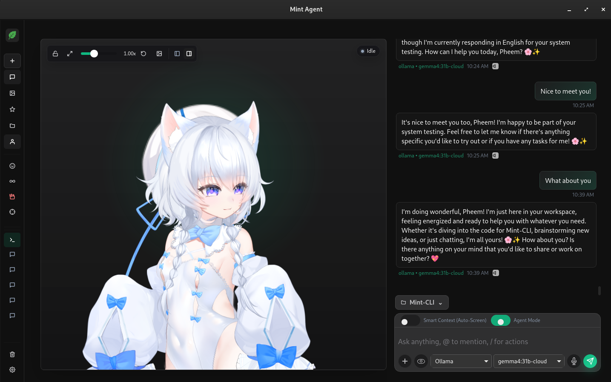
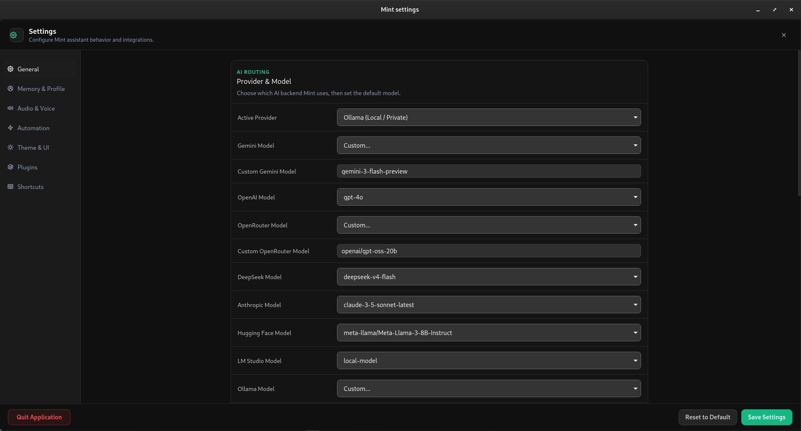
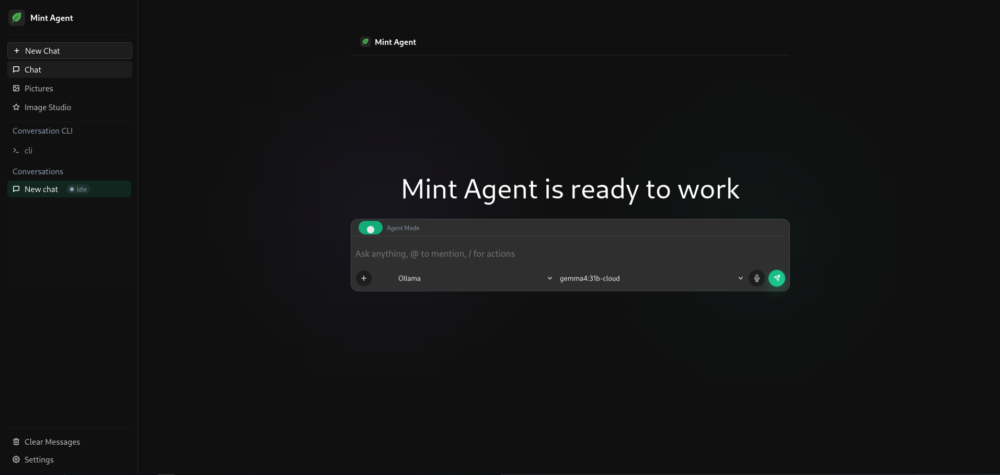
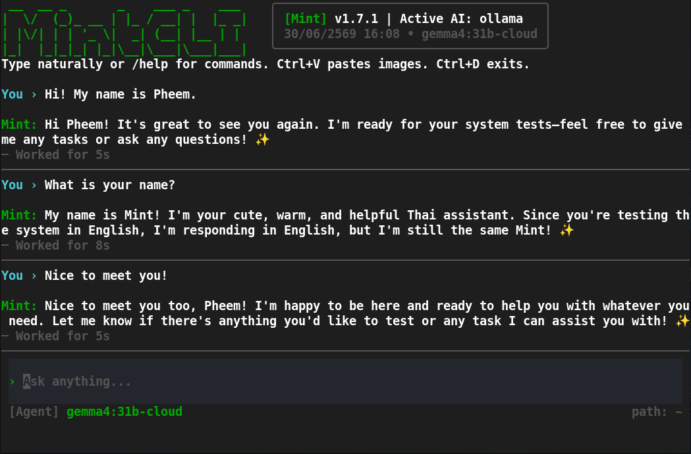
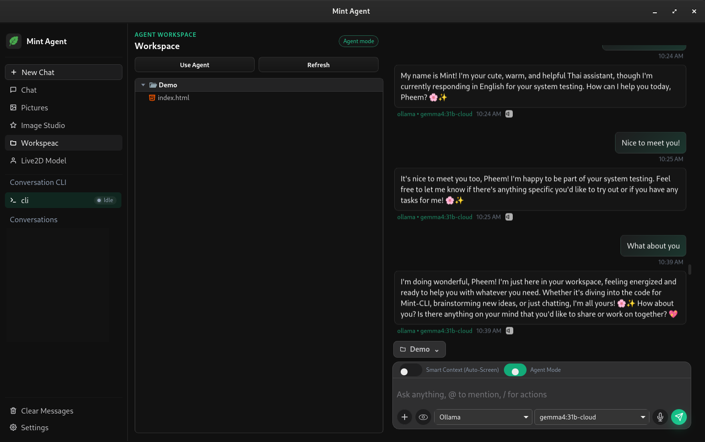

<div align="center">
  

  # Mint

  **A native desktop AI assistant with a shared Rust core and an optional terminal interface.**

  [](https://v2.tauri.app/)
  [](https://www.rust-lang.org/)
  [](https://react.dev/)
  [](LICENSE)
</div>

Mint is a local-first AI assistant built with Tauri v2, Rust, React, and TypeScript.
The desktop application and native CLI share the same Rust domain layer, so chat,
memory, knowledge, tools, safety policies, and integrations behave consistently
across both interfaces.

##  What Mint Can Do

Mint is a local-first AI assistant running on your machine, capable of handling tasks via either the desktop application or the terminal interface (CLI):

---

### 1.  AI Chat & Multi-Providers
- Connect to **Gemini, OpenAI, Anthropic (Claude), Ollama (Local), Hugging Face**, and LM Studio.
- Run private local LLMs inside your machine using Ollama or connect to leading cloud APIs.
- Supports system instructions, temperature adjustments, voice replies, and image analysis (Multimodal).

---

### 2.  Interactive Live2D Desktop Assistant
- An interactive anime avatar (**Shiroko**) displayed right on your desktop with gaze tracking (eye/face follows your mouse pointer).
- Toggle expression changes and cycle through character accessories dynamically.
- Custom interaction zones (Head, Cheek, Hands, Body) that trigger unique animations and message toasts.

---

### 3.  Autonomous Code Agent
- Run code agent loops via `/code <task>` or the terminal command `mint code agent "<task>"`.
- Scan your project workspace, build multi-file implementation plans, fix test suite errors, and write edits automatically.
- Run local tests, cargo checks, and shell commands.
> [!IMPORTANT]
> **Safety First:** Risky actions and file writes require your explicit terminal approval first.

---

### 4.  Long-Term Memory & Knowledge Base
- Persistent conversation memory stored locally in SQLite. Manage user profile memory with `/memory set/get` or CLI commands.
- Index local directories, text files, and documentation to build your private searchable knowledge base.

---

### 5.  Tool & MCP Integrations
- Support **Model Context Protocol (MCP)** to connect tools like Google/Brave Search, Filesystem servers, and GitHub context.
- **Auto GitHub Link Resolver:** Automatically detects GitHub URLs in chat messages (CLI, Web, and Desktop) and Code Agent tasks. It fetches and injects the repository's metadata, directory structure, and README as prompt context, serving as an instant fallback when the GitHub MCP server is not active.
- Local plugins for Spotify playback control, Google Calendar, Gmail drafts, and Notion workspace reading.

---

### 6.  Messaging Bridges
- Bridge your local AI assistant to messaging services: **Telegram, Discord Gateway, Discord RPC, Slack, LINE, and WhatsApp**.
- Host local chatbot webhooks that relay chat traffic into your configured LLM.
> [!TIP]
> **Headless Background Execution:** Enabled bridges automatically run in the background when you launch either the desktop application OR the local API/Web server (`mint api` / `mint web`). This allows you to chat with Mint from anywhere without needing the desktop GUI window open.

---

### 7.  Screen Capture & Translation
- Capture screen snapshots for instant visual analysis by the AI.
- Real-time continuous overlay translation of specific screen regions.

---

### 8.  AI Image Generation
- Generate high-quality images directly from chat or terminal using **DALL-E 3, Stability AI (Stable Diffusion), Ideogram, Replicate (Flux)**, and Google NanoBanana.
- Supports aspect ratio selections, negative prompts, custom image counts, and automatic storage of generated pictures to the local library.

---

## Highlights

- Multi-provider chat with Gemini, OpenAI, Anthropic, Ollama, Hugging Face, and
  local OpenAI-compatible endpoints.
- Image generation using DALL-E 3, Stability AI, Ideogram, Replicate, and NanoBanana.
- Native streaming responses, SQLite-backed memory, tasks, searchable local
  knowledge, skills, and semantic code search.
- Desktop dashboard with a Live2D assistant, model interaction areas, pictures,
  screen capture, continuous translation, spotlight, tray, widget, and proactive
  suggestions.
- Native code-agent workflow for workspace inspection, planning, editing, shell
  execution, and verification with explicit approval for risky actions.
- MCP servers, local plugins, custom workflows, weather, web search, and
  optional external services.
- Telegram, Discord Gateway, Discord RPC, Slack Socket Mode, LINE, and WhatsApp
  Cloud API integrations.
- Signed Tauri update checks with an explicit approval step before installation.
- Dynamic local Ollama model fetching in the Settings Window to query and display the actual models installed on your machine.
- Pill-styled clean horizontal system event dividers for provider and model change notifications in the chat panel.
- Global unrestricted text selection and copying enabled across all application components.
- Spacious 1100px widescreen layout for the Chat Panel when the interactive model is hidden.
- Advanced Workspace File Tree featuring:
  - Automatic directory refreshing upon window focus and 15-second polling.
  - Quick action buttons to create new files and folders.
  - Right-click context menu to delete files/folders with confirmation modals.
  - Drag-and-drop file mentions in the chat input with automatic spacing and dynamic accent-colored history bubble highlighting.

## What's New in v1.8.1

- **Advanced Workspace File Tree & Operations**: Manage files directly from the sidebar UI with file/folder creation buttons, right-click deletion modals, and automatic polling + focus-based syncing.
- **Drag-and-Drop File Mentions**: Drag files from the sidebar to chat input to insert `@filename` with auto-spacing, rendered as outline pills styled with your selected accent color.
- **CLI Agent Interface Polish & Terminal Line Wrapping Fix**: Indented status blocks and confirmation prompts by 2 spaces to align text. Implemented the *Dynamic Breathing Circle System* (`●` ⇄ `○` pulsing during thinking) and fixed terminal duplicate line bugs by counting physical terminal wrapping width and filtering Thai tone marks.
- **AskUser Text Input Modal (Desktop & Web)**: When the agent asks questions, a text input field is rendered inside the approval card so users can write and submit typed answers back to the agent backend.
- **Dynamic Language AI Suggestions**: Auto-translates process suggestions dynamically based on your configured `config.language`.
- **Mobile & Navigation Optimizations**: Mobile-fit Image Studio layout, hamburger menu access, and headers glass-morphism overlay fixes.

## What's New in v1.8.0

- **Integrated Web Search Settings**: Easily toggle between **Brave Search API** and **Google Custom Search API** directly from the General settings tab.
- **Image Generation Providers**: Choose and configure credentials for Stability AI, Ideogram, Replicate, OpenAI DALL-E, and Google NanoBanana (Gemini Images) inside dedicated inline settings cards.
- **Inline Productivity Settings**: Set up Client IDs, secrets, and API keys for native Gmail, Google Calendar, and Notion integrations inline inside the General settings tab.
- **Revamped Plugins Layout**: Moved **Learned AI Skills** (equivalent to `mint learn` in CLI) to the top of the Plugins tab, followed by MCP Servers (External tools), and Built-in Plugins (Spotify and Discord RPC) at the bottom.

##  Prerequisites

Before you can build or run Mint locally, make sure you have the following system tools installed:

| Tool | Description | Required For |
| :--- | :--- | :--- |
| **Node.js & npm** | JavaScript runtime and package manager | Frontend UI (React, Vite, TypeScript) |
| **Rust Toolchain** | Rust compiler (`rustc`) and package manager (`cargo`) | Shared domain logic, CLI, and Tauri backend |
| **System Dependencies** | Native OS libraries (compiler tools, dbus, webkit) | Compiling window GUI, Webview rendering, and OS utilities |

### Linux Dependencies

Install the required C compilers, WebKitGTK, and system libraries for your specific Linux distribution:

**Debian / Ubuntu / Linux Mint:**
```bash
sudo apt-get install -y \
  build-essential curl file pkg-config wget \
  libdbus-1-dev libwebkit2gtk-4.1-dev \
  libayatana-appindicator3-dev librsvg2-dev \
  poppler-utils unzip patchelf
```

**Fedora / RHEL / CentOS:**
```bash
sudo dnf groupinstall -y "Development Tools"
sudo dnf install -y \
  webkit2gtk4.1-devel openssl-devel curl wget glibc-devel \
  dbus-devel libayatana-appindicator-devel librsvg2-devel \
  poppler-utils unzip patchelf
```

**Arch Linux:**
```bash
sudo pacman -Syu --needed \
  base-devel webkit2gtk-4.1 openssl curl wget \
  dbus libayatana-appindicator librsvg \
  poppler unzip patchelf
```

> [!TIP]
> **Other Platforms:** If you are developing on macOS or Windows, follow the official [Tauri Prerequisites Guide](https://v2.tauri.app/start/prerequisites/) to set up your build environment.

## Installation

### Quick Install (Recommended)
The easiest way to install Mint CLI is using our installation script:

**For macOS & Linux:**
```bash
curl -fsSL https://raw.githubusercontent.com/Pheem49/Mint/main/install.sh | bash
```

**For Windows (PowerShell):**
```powershell
powershell -Command "iwr -useb https://raw.githubusercontent.com/Pheem49/Mint/main/install.ps1 | iex"
```

---
### Quick Start
```bash
mint onboard
mint setup
mint 
mint web
mint chat "Hello"
mint imagine "A futuristic mint-colored robot" --aspect 16:9
```

Most integrations can be configured from:
```bash
mint onboard
mint setup
mint
```

### Manual Installation

### 1. Configure API Keys
Copy the template and configure your LLM credentials (Gemini, OpenAI, Anthropic, etc.):
```bash
cp .env.example .env
```
Open the `.env` file and insert your API keys (e.g. `GEMINI_API_KEY=your_key_here`).

### 2. Desktop Application
Install the dependencies and start the application in development mode:
```bash
npm install
npm run tauri:dev
```
To compile and build a production standalone desktop package:
```bash
npm run tauri:build
```
*(The Vite renderer output is generated in `out/renderer` and can be manually built via `npm run build:web`)*

### 3. Native CLI
To install the `mint` command-line tool globally:

* **Option A (Release Build - Recommended for speed):**
  ```bash
  cargo build --release -p mint-cli
  sudo cp target/release/mint /usr/local/bin/
  ```
* **Option B (Cargo Install):**
  ```bash
  cargo install --path crates/mint-cli
  ```
* **Option C (Development Shell Alias):**
  If you are actively modifying code and want changes to reflect instantly, set up the alias under the [Setting up the mint Shortcut](#setting-up-the-mint-shortcut) section.


## User Interface

### Desktop App
<table width="100%">
  <tr>
    <td align="center" width="50%"><b>Desktop Assistant</b></td>
    <td align="center" width="50%"><b>Settings</b></td>
  </tr>
  <tr>
    <td></td>
    <td></td>
  </tr>
</table>

### Web UI
<table width="100%">
  <tr>
    <td align="center"></td>
  </tr>
</table>

### CLI
<table width="100%">
  <tr>
    <td align="center"></td>
  </tr>
</table>

### Workspace & Agent
<table width="100%">
  <tr>
    <td align="center"></td>
  </tr>
</table>

## Desktop Assistant

The desktop application provides:

- A streaming chat panel with provider selection and optional smart context.
- A Live2D model panel with gaze tracking, interaction zones, and visual area
  guides.
- Local conversation memory, tasks, searchable knowledge, and pictures.
- Screen capture and continuous screen translation.
- Spotlight, widget, tray, proactive glow, and background task queue windows.
- Settings for models, API keys, voice, automation, integrations, MCP servers,
  workflows, appearance, updates, and agent collaboration.

The sidebar, Live2D interaction state, and area-guide visibility are stored
locally so the dashboard restores the previous UI state after restarting.

## Native CLI

You can interact with Mint's Rust backend directly using the command line. If you set up the `mint` shortcut alias, you can run commands directly as `mint <command>`. Otherwise, you can fall back to running them through npm as `npm run cli -- <command>`.

### Setting up the `mint` Shortcut

You can choose one of the following methods to enable the global `mint` command:

**Option 1: Using Shell Alias (For active development - updates instantly on code changes)**

To run the commands using the prefix `mint` from anywhere in your workspace (automatically compiling your code updates on execution):

*For Bash (`~/.bashrc`):*
```bash
echo 'alias mint="cargo run --manifest-path /home/pheem49/vscode/Project/Mint-CLI/Cargo.toml -p mint-cli --"' >> ~/.bashrc
source ~/.bashrc
```

*For Zsh (`~/.zshrc`):*
```bash
echo 'alias mint="cargo run --manifest-path /home/pheem49/vscode/Project/Mint-CLI/Cargo.toml -p mint-cli --"' >> ~/.zshrc
source ~/.zshrc
```

**Option 2: Install via Cargo (For standard Rust installation)**

This will compile the Rust CLI and install it inside your native Cargo binary directory:

```bash
cargo install --path crates/mint-cli
```
*Note: Make sure your `~/.cargo/bin` is added to your shell's `$PATH` variable.*

**Option 3: Compile and Install Globally (For release binary - fastest run speed)**

If you want to compile the project in release mode and install it directly to your system's global binaries directory (for the fastest startup time without cargo check overhead):

```bash
# Build the binary in release mode
cargo build --release -p mint-cli

# Copy it into your system binary directory
sudo cp target/release/mint /usr/local/bin/
```
Once copied, you can run `mint` globally from any folder in your terminal!mint chat "Hello"

---

### Start Interactive Chat Assistant

To start the interactive terminal AI chatbot assistant, simply run:

```bash
mint
# Or fallback: npm run cli
```
This opens the Mint interactive shell, where you can type prompts naturally or use `/commands` (like `/help`, `/cd`, `/clear`, `/exit`).

---

### CLI Subcommands

You can run individual subcommands by appending them after `mint`:

```bash
mint onboard
mint setup
mint status
mint web
mint api
mint chat "<message>"
```

### Common Commands

| Command | Purpose |
| --- | --- |
| `mint` | Start the interactive terminal chat assistant |
| `mint onboard` | Configure Mint for first use |
| `mint setup` | Interactively manage enabled agent tools |
| `mint web` | Launch the web UI and local API server |
| `mint api` | Start only the local API server |
| `mint status` | Show runtime status |
| `mint config init` | Create the local configuration file |
| `mint config path` | Print the configuration file path |
| `mint config show` | Print the current configuration |
| `mint config set <key> <value>` | Update a configuration value |
| `mint config doctor` | Validate the local setup |
| `mint providers` | List configured AI providers |
| `mint chat "<message>"` | Send one chat message |
| `mint imagine "<prompt>"` | Generate an image from a text prompt |
| `mint memory recent` | Show recent conversation memory |
| `mint task list` | List all tasks (pending and completed) |
| `mint task pending` | List pending tasks |
| `mint knowledge add <path>` | Index a local document |
| `mint knowledge search "<query>"` | Search indexed knowledge |
| `mint plugin list` | List local plugins |
| `mint mcp list` | List configured MCP servers |
| `mint learn <path>` | Import a persistent learned skill file |
| `mint update --check` | Check for an available update |


### Code Agent

Mint includes native workspace tools for code inspection, planning, editing, and execution:

```bash
mint code agent "inspect this repo and fix the failing tests"
mint code github-overview "Pheem49/Mint"
mint code summary .
mint code search "shell approval flow" .
mint symbols .
mint semantic-code index .
mint semantic-code search "provider fallback"
```

Inside interactive mode, use:

```text
/code <task>
```

Code-related fixes, workspace inspection, and test requests are routed into the code-agent loop automatically. Shell commands and file edits require explicit terminal approval before Mint applies them.

### Tools And Automation

```bash
mint files find README
mint safety path README.md
mint safety shell cargo test -p mint-core
mint run --approve -- cargo test -p mint-core
mint open README.md
mint open-app code
mint learn ./skill.md
```

### MCP Servers

Add a local MCP server and call one of its tools:

```bash
mint mcp add filesystem npx \
  --args -y \
  --args @modelcontextprotocol/server-filesystem \
  --args .

mint mcp list
mint mcp call filesystem list_directory \
  --arguments '{"path":"."}'
```

### Interactive Commands

| Command | Purpose |
| --- | --- |
| `/help` | Show interactive help |
| `/fast [on\|off]` | Toggle fast response mode |
| `/models [name]` | List or select a model |
| `/clear` or `/reset` | Clear the active conversation |
| `/cd <path>` | Change workspace directory |
| `/image <path> [prompt]` | Send an image with an optional prompt |
| `/paste [prompt]` | Use an image from the clipboard |
| `/learn <path>` | Import a local skill |
| `/memory list` | List stored memories |
| `/memory clear` | Clear stored memories |
| `/memory get <key>` | Read one memory value |
| `/memory set <key> <value>` | Store one memory value |
| `/stats` | Show session statistics |
| `/code <task>` | Start a code-agent task |
| `/exit` or `/quit` | Leave interactive mode |

## Configuration

Mint stores its local configuration in the platform config directory:

| Platform | Typical path |
| --- | --- |
| Linux | `~/.config/mint/mint-config.json` |
| macOS | `~/Library/Application Support/mint/mint-config.json` |
| Windows | `%APPDATA%\mint\mint-config.json` |

Create and inspect the configuration:

```bash
npm run cli -- config init
npm run cli -- config path
npm run cli -- config show
npm run cli -- config doctor
```

Configuration covers provider credentials, model preferences, browser context,
voice and TTS, proactive suggestions, headless tasks, updates, workflows, MCP
servers, and optional integrations such as Calendar, Gmail, Notion, Telegram,
Discord, Slack, LINE, WhatsApp, Google Search, and Brave Search.

The optional browser smart-context helper can provide active-tab context from:

```text
http://127.0.0.1:3212/context
```

Chromium automation uses the local debugging endpoint:

```text
http://127.0.0.1:9222/json/list
```

## Webhook Integrations

LINE and WhatsApp webhook listeners bind to localhost by default. Read
[`docs/WEBHOOK_FORWARDING.md`](docs/WEBHOOK_FORWARDING.md) before exposing them
through a TLS tunnel.

## Safety And Privacy

Mint keeps high-risk behavior behind explicit policy checks:

- Shell commands are evaluated before execution.
- Code edits and update installation require approval.
- Sensitive directories such as `.ssh`, `.gnupg`, and Mint's own config
  directory are protected by default.
- Sensitive filenames such as `.env` and private key files are blocked from
  routine workspace access.
- LINE and WhatsApp webhook services listen locally unless you intentionally
  forward them.

Review the generated command or edit preview before approving an action.

## Development

Useful validation commands:

```bash
npm run build:web
cargo test -p mint-core -p mint-cli -p mint-desktop
cargo check -p mint-desktop
npm run tauri:build -- --debug --no-bundle
```

### Project Layout

```text
crates/mint-core   Shared Rust domain logic
crates/mint-cli    Native Rust CLI
src-tauri          Tauri desktop backend and IPC commands
src/renderer       React and TypeScript webview UI
docs               Project documentation
out/renderer       Generated Vite renderer output
```

## Migration Status

Mint's historical Electron desktop runtime and Node CLI have been removed. The
active application is the native Tauri v2 and Rust implementation documented
above. See [`TAURI_MIGRATION.md`](TAURI_MIGRATION.md) for compatibility notes.

## Contributing

We welcome contributions from the community! Whether you want to fix a bug, add a new provider, or build a new integration, please check out our [CONTRIBUTING.md](file:///home/pheem49/vscode/Project/Mint-CLI/CONTRIBUTING.md) guide for setup instructions, project architecture details, and our roadmap.

## License

Mint is licensed under the [AGPL-3.0-only license](LICENSE).

