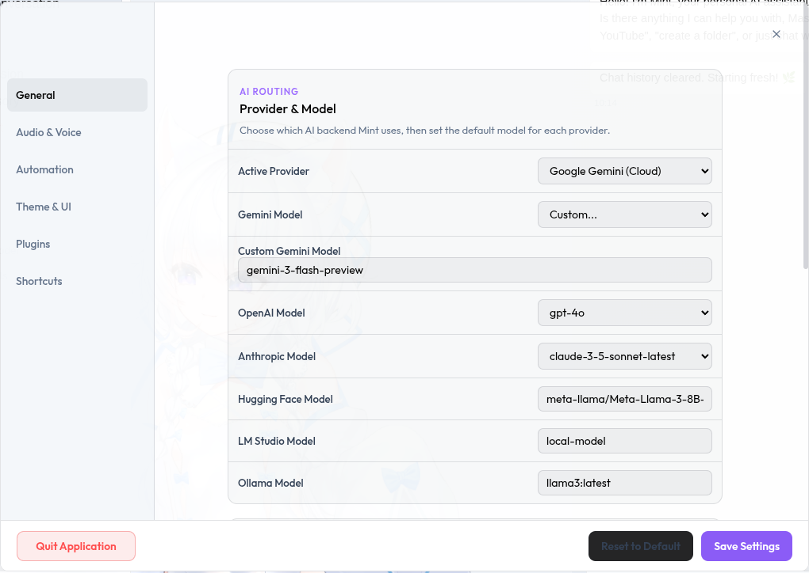
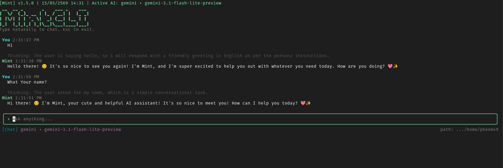

<div align="center">
  

  # Mint

  **A native desktop AI assistant with a shared Rust core and an optional terminal interface.**

  [](https://v2.tauri.app/)
  [](https://www.rust-lang.org/)
  [](https://react.dev/)
  [](LICENSE)
</div>

Mint is a local-first AI assistant built with Tauri v2, Rust, React, and TypeScript.
The desktop application and native CLI share the same Rust domain layer, so chat,
memory, knowledge, tools, safety policies, and integrations behave consistently
across both interfaces.

## Highlights

- Multi-provider chat with Gemini, OpenAI, Anthropic, Ollama, Hugging Face, and
  local OpenAI-compatible endpoints.
- Native streaming responses, SQLite-backed memory, tasks, searchable local
  knowledge, skills, and semantic code search.
- Desktop dashboard with a Live2D assistant, model interaction areas, pictures,
  screen capture, continuous translation, spotlight, tray, widget, and proactive
  suggestions.
- Native code-agent workflow for workspace inspection, planning, editing, shell
  execution, and verification with explicit approval for risky actions.
- MCP servers, local plugins, custom workflows, weather, web search, and
  optional external services.
- Telegram, Discord Gateway, Discord RPC, Slack Socket Mode, LINE, and WhatsApp
  Cloud API integrations.
- Signed Tauri update checks with an explicit approval step before installation.

## Screenshots

| Desktop assistant | Settings |
| --- | --- |
|  |  |



## Prerequisites

- Node.js and npm
- A Rust toolchain
- Tauri v2 native build dependencies for your operating system

On Debian, Ubuntu, or Linux Mint:

```bash
sudo apt-get install -y \
  build-essential curl file pkg-config wget \
  libdbus-1-dev libwebkit2gtk-4.1-dev \
  libayatana-appindicator3-dev librsvg2-dev \
  poppler-utils unzip patchelf
```

See the [Tauri prerequisites guide](https://v2.tauri.app/start/prerequisites/)
for other platforms.

## Run From Source

Install the web dependencies and start the desktop application:

```bash
npm install
npm run tauri:dev
```

Create a production desktop build:

```bash
npm run tauri:build
```

The Vite renderer output is generated in `out/renderer`. It is build output and
can be regenerated with `npm run build:web`.

## Desktop Assistant

The desktop application provides:

- A streaming chat panel with provider selection and optional smart context.
- A Live2D model panel with gaze tracking, interaction zones, and visual area
  guides.
- Local conversation memory, tasks, searchable knowledge, and pictures.
- Screen capture and continuous screen translation.
- Spotlight, widget, tray, proactive glow, and background task queue windows.
- Settings for models, API keys, voice, automation, integrations, MCP servers,
  workflows, appearance, updates, and agent collaboration.

The sidebar, Live2D interaction state, and area-guide visibility are stored
locally so the dashboard restores the previous UI state after restarting.

## Native CLI

Run the CLI directly from the workspace:

```bash
npm run cli -- status
npm run cli -- config doctor
npm run cli -- chat "Hello"
```

Start the interactive terminal assistant:

```bash
npm run cli
```

### Common Commands

| Command | Purpose |
| --- | --- |
| `status` | Show runtime status |
| `config init` | Create the local configuration file |
| `config path` | Print the configuration file path |
| `config show` | Print the current configuration |
| `config set <key> <value>` | Update a configuration value |
| `config doctor` | Validate the local setup |
| `providers` | List configured AI providers |
| `chat "<message>"` | Send one chat message |
| `memory recent` | Show recent conversation memory |
| `task pending` | List pending tasks |
| `knowledge add <path>` | Index a local document |
| `knowledge search "<query>"` | Search indexed knowledge |
| `plugin list` | List local plugins |
| `mcp list` | List configured MCP servers |
| `update --check` | Check for an available update |

### Code Agent

Mint includes native workspace tools for code inspection and editing:

```bash
npm run cli -- code agent "inspect this repo and fix the failing tests"
npm run cli -- code summary .
npm run cli -- code search "shell approval flow" .
npm run cli -- symbols .
npm run cli -- semantic-code index .
npm run cli -- semantic-code search "provider fallback"
```

Inside interactive mode, use:

```text
/code <task>
```

Code-related fixes, workspace inspection, and test requests are routed into the
code-agent loop automatically. Shell commands and file edits require explicit
terminal approval before Mint applies them.

### Tools And Automation

```bash
npm run cli -- files find README
npm run cli -- safety path README.md
npm run cli -- safety shell cargo test -p mint-core
npm run cli -- run --approve -- cargo test -p mint-core
npm run cli -- open README.md
npm run cli -- open-app code
npm run cli -- learn ./skill.md
```

### MCP Servers

Add a local MCP server and call one of its tools:

```bash
npm run cli -- mcp add filesystem npx \
  --args -y \
  --args @modelcontextprotocol/server-filesystem \
  --args .

npm run cli -- mcp list
npm run cli -- mcp call filesystem list_directory \
  --arguments '{"path":"."}'
```

### Interactive Commands

| Command | Purpose |
| --- | --- |
| `/help` | Show interactive help |
| `/fast [on\|off]` | Toggle fast response mode |
| `/models [name]` | List or select a model |
| `/clear` or `/reset` | Clear the active conversation |
| `/cd <path>` | Change workspace directory |
| `/image <path> [prompt]` | Send an image with an optional prompt |
| `/paste [prompt]` | Use an image from the clipboard |
| `/learn <path>` | Import a local skill |
| `/memory list` | List stored memories |
| `/memory clear` | Clear stored memories |
| `/memory get <key>` | Read one memory value |
| `/memory set <key> <value>` | Store one memory value |
| `/stats` | Show session statistics |
| `/code <task>` | Start a code-agent task |
| `/exit` or `/quit` | Leave interactive mode |

## Configuration

Mint stores its local configuration in the platform config directory:

| Platform | Typical path |
| --- | --- |
| Linux | `~/.config/mint/mint-config.json` |
| macOS | `~/Library/Application Support/mint/mint-config.json` |
| Windows | `%APPDATA%\mint\mint-config.json` |

Create and inspect the configuration:

```bash
npm run cli -- config init
npm run cli -- config path
npm run cli -- config show
npm run cli -- config doctor
```

Configuration covers provider credentials, model preferences, browser context,
voice and TTS, proactive suggestions, headless tasks, updates, workflows, MCP
servers, and optional integrations such as Calendar, Gmail, Notion, Telegram,
Discord, Slack, LINE, WhatsApp, Google Search, and Brave Search.

The optional browser smart-context helper can provide active-tab context from:

```text
http://127.0.0.1:3212/context
```

Chromium automation uses the local debugging endpoint:

```text
http://127.0.0.1:9222/json/list
```

## Webhook Integrations

LINE and WhatsApp webhook listeners bind to localhost by default. Read
[`docs/WEBHOOK_FORWARDING.md`](docs/WEBHOOK_FORWARDING.md) before exposing them
through a TLS tunnel.

## Safety And Privacy

Mint keeps high-risk behavior behind explicit policy checks:

- Shell commands are evaluated before execution.
- Code edits and update installation require approval.
- Sensitive directories such as `.ssh`, `.gnupg`, and Mint's own config
  directory are protected by default.
- Sensitive filenames such as `.env` and private key files are blocked from
  routine workspace access.
- LINE and WhatsApp webhook services listen locally unless you intentionally
  forward them.

Review the generated command or edit preview before approving an action.

## Development

Useful validation commands:

```bash
npm run build:web
cargo test -p mint-core -p mint-cli -p mint-desktop
cargo check -p mint-desktop
npm run tauri:build -- --debug --no-bundle
```

### Project Layout

```text
crates/mint-core   Shared Rust domain logic
crates/mint-cli    Native Rust CLI
src-tauri          Tauri desktop backend and IPC commands
src/renderer       React and TypeScript webview UI
docs               Project documentation
out/renderer       Generated Vite renderer output
```

## Migration Status

Mint's historical Electron desktop runtime and Node CLI have been removed. The
active application is the native Tauri v2 and Rust implementation documented
above. See [`TAURI_MIGRATION.md`](TAURI_MIGRATION.md) for compatibility notes.

## License

Mint is licensed under the [AGPL-3.0-only license](LICENSE).
