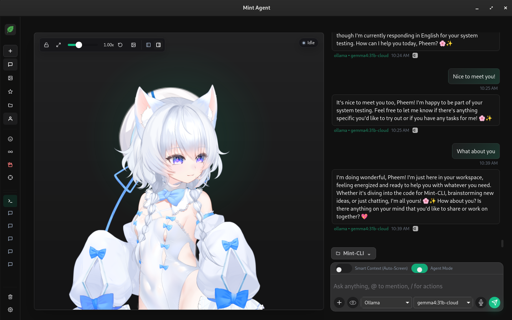
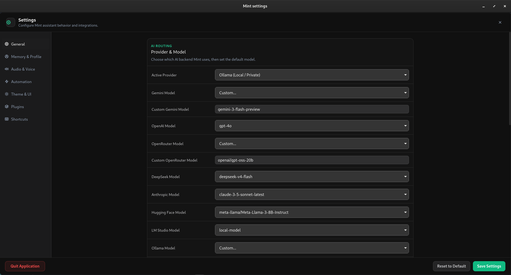
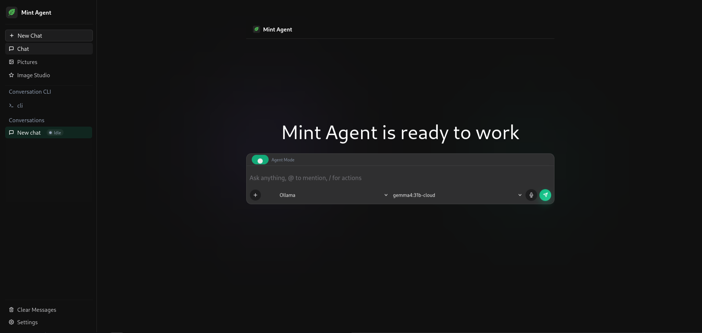
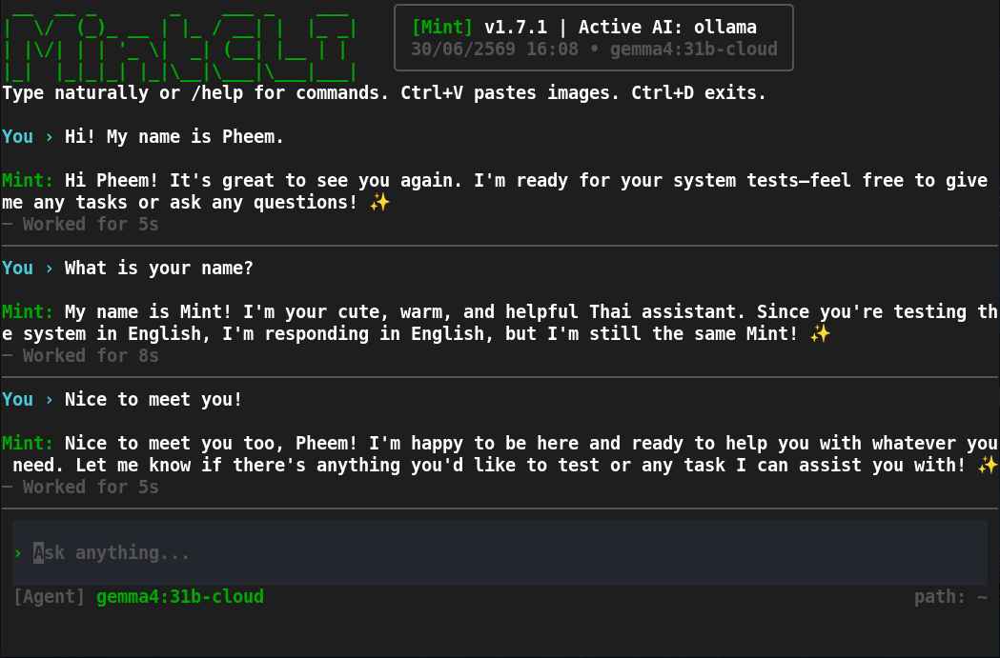
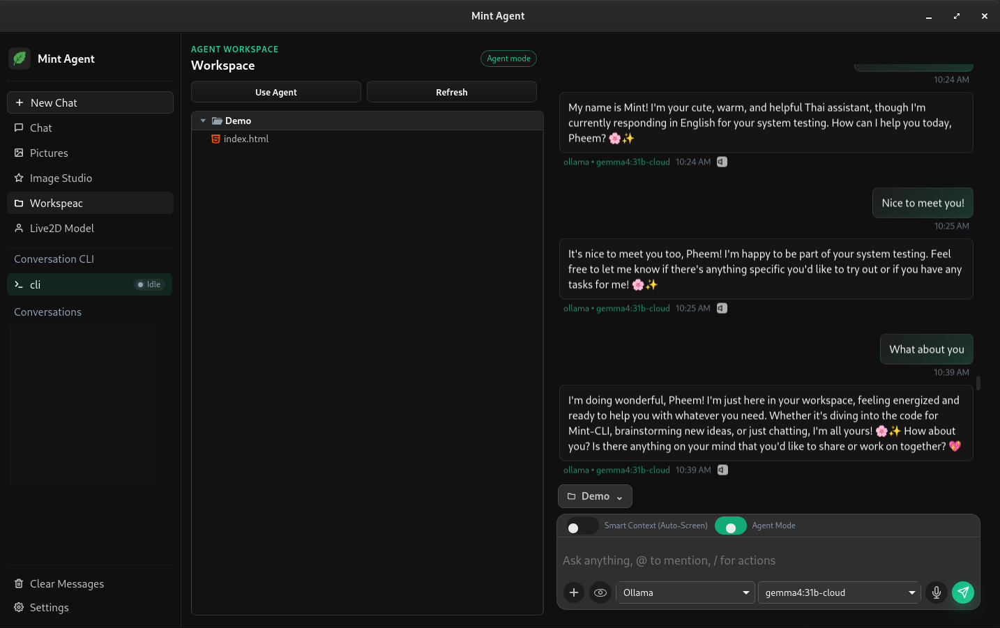

<div align="center">
  

  # Mint

  **Your AI agent, reachable from Telegram, Discord, Slack, LINE, or WhatsApp — not just a terminal window.**

  [](https://v2.tauri.app/)
  [](https://www.rust-lang.org/)
  [](https://react.dev/)
  [](LICENSE)
</div>

Mint is a local-first AI assistant that runs on your own machine and follows you
wherever you already are: message it from Telegram, Discord, Slack, LINE, or
WhatsApp like you'd message a person, no desktop window required. It's also a
native desktop app with a Live2D companion, and a full terminal agent for
coding tasks — all backed by the same Tauri v2 + Rust + React/TypeScript core,
so chat, memory, knowledge, tools, and safety policies behave identically no
matter which door you walk in through.

## 🆕 Recent Updates (v1.11.0)

- **Image Search Tool**: New `image_search` agent action (Google Custom Search Image API with a Brave Images API fallback) lets Mint find and show picture results on request, separate from the automatic thumbnail that already appears on regular web searches. Renders as a native image-grid card on Desktop and Web (`ImageSearchCard.tsx`).
- **Shared Prompt Module**: Consolidated the previously duplicated persona/system-prompt text across the CLI agent loop, CLI chat mode, and the API server into a single `crates/mint-core/src/prompts/` module (`persona.rs`, `agent.rs`, `chat.rs`), so tone, safety policy, and answer-quality rules only need to be edited once.
- **More Complete Answers**: Tightened the agent's system prompt so final answers cover everything the user asked instead of being cut short for the sake of brevity.
- **CLI Markdown Tables**: Tables produced by the agent loop (e.g. skill/repo listings) now render as proper box-drawing tables in the terminal instead of raw `|`-pipe text.
- **Consolidated Sources UI**: Merged the previously duplicated "image strip + domain cards" layout in the chat Sources panel into a single row, with sources that have a thumbnail shown first and the whole card clickable.
- **SVG Icons Across Result Cards**: Replaced emoji icons with `lucide-react` SVG icons on the Weather, Stock, Calculation, and Image Search cards for a more consistent look across themes.
- **Accurate Tool Activity Labels**: The "Working through task" activity table on Desktop and Web now shows the real tool/action name (`web_search`, `image_search`, `weather`, …), matching what the CLI already displays.
- **Web Deep-Link Fix**: Fixed a bug where opening or refreshing a direct chat URL (e.g. `/chat/<conversation-id>`) on `mint web` showed a blank white page — the production web build used a relative asset base path that broke on any URL besides `/`.
- **Docker Sandbox for Subagents**: `dispatch_subagent`-spawned subagents can now run their shell commands inside an isolated, ref-counted Docker container (`sandboxBackend: "docker"`, or a per-subagent `sandbox: docker` frontmatter override) instead of only the shared host-level bwrap/sandbox-exec sandbox.
- **Web UI Is Now Installable (PWA)**: `mint web` can be added to a phone's home screen like a native app — a web manifest, generated icon set, and a narrowly-scoped service worker (never caches `/api/*`, so chat/agent responses stay live) make the existing Web UI installable with no app store and no separate mobile codebase.
- **Linked Folders Cross-Reference Each Other**: Notes auto-saved into a linked folder can now wiki-link related earlier notes (`[[YYYY-MM-DD#HH:MM]]`, matching the file's own heading format so it resolves in a real Obsidian vault too), instead of being a flat, unlinked pile of daily files.
- **Self-Evolving Skills, On By Default**: `auto_skill_writing` now defaults to on. When a task matches an existing skill, the agent is shown that skill's full current content and asked to genuinely refine/merge it rather than risk a blind overwrite, and every write stamps a `revisions:` count computed in code (not trusted to the model's own arithmetic).

##  What Mint Can Do

Mint is a local-first AI assistant running on your machine, capable of handling tasks from a messaging app, the desktop application, or the terminal interface (CLI):

---

### 1.  Reach Mint From Anywhere — Messaging Bridges
- Message your local AI assistant like you'd message a person, from **Telegram, Discord Gateway, Discord RPC, Slack, LINE, WhatsApp, Signal, and Email (via Gmail)** — no desktop window required.
- Enabled bridges run automatically in the background alongside the desktop app, `mint api`/`mint web`, or — for running 24/7 on a VPS with no session attached at all — `mint gateway start`. See [Running Mint 24/7 on a VPS](#running-mint-247-on-a-vps-headless-gateway) below.
- Every bridge locks itself to a single owner the first time it hears from anyone: whoever messages it first is claimed as the owner, and everyone else is ignored from then on.
- All bridges share one continuous memory/conversation with the terminal CLI — pick up a conversation on Telegram that you started in the terminal, and vice versa.

---

### 2.  Interactive Live2D Desktop Assistant
- An interactive anime avatar (**Shiroko**) displayed right on your desktop with gaze tracking (eye/face follows your mouse pointer).
- Toggle expression changes and cycle through character accessories dynamically.
- Custom interaction zones (Head, Cheek, Hands, Body) that trigger unique animations and message toasts.

---

### 3.  AI Chat & Multi-Providers
- Connect to **Gemini, OpenAI, Anthropic (Claude), Ollama (Local), Hugging Face**, and LM Studio.
- Run private local LLMs inside your machine using Ollama or connect to leading cloud APIs.
- Supports system instructions, temperature adjustments, voice replies, and image analysis (Multimodal).

---

### 4.  Autonomous Code Agent
- Run code agent loops via `/code <task>` or the terminal command `mint code agent "<task>"`.
- Scan your project workspace, build multi-file implementation plans, fix test suite errors, and write edits automatically.
- Run local tests, cargo checks, and shell commands.
> [!IMPORTANT]
> **Safety First:** Risky actions and file writes require your explicit terminal approval first.

---

### 5.  Long-Term Memory & Knowledge Base
- Persistent conversation memory stored locally in SQLite. Manage user profile memory with `/memory set/get` or CLI commands.
- Index local directories, text files, and documentation to build your private searchable knowledge base.

---

### 6.  Tool & MCP Integrations
- Support **Model Context Protocol (MCP)** to connect tools like Google/Brave Search, Filesystem servers, and GitHub context.
- Dedicated **Image Search** tool (Google Custom Search Image / Brave Images) for finding and browsing pictures on request, rendered as an image-grid card on Desktop and Web.
- **Auto GitHub Link Resolver:** Automatically detects GitHub URLs in chat messages (CLI, Web, and Desktop) and Code Agent tasks. It fetches and injects the repository's metadata, directory structure, and README as prompt context, serving as an instant fallback when the GitHub MCP server is not active.
- Local plugins for Spotify playback control, Google Calendar, Gmail drafts, and Notion workspace reading.

---

### 7.  Screen Capture & Translation
- Capture screen snapshots for instant visual analysis by the AI.
- Real-time continuous overlay translation of specific screen regions.

---

### 8.  AI Image Generation
- Generate high-quality images directly from chat or terminal using **DALL-E 3, Stability AI (Stable Diffusion), Ideogram, Replicate (Flux)**, and Google NanoBanana.
- Supports aspect ratio selections, negative prompts, custom image counts, and automatic storage of generated pictures to the local library.

---

### 9.  Browser Automation (`mint auto`)
- Control and automate web pages directly from either the terminal or the GUI desktop chat.
- Runs a dedicated, isolated Chromium instance on port `9222` with state separation using the command `mint auto`.
- Supports opening URLs (`browser_open`), clicking buttons/elements (`browser_click`), typing text (`browser_type`), and extracting content (`browser_read`).
- **Dynamic Tool Injection:** The agent automatically registers these browser capability tools only when it detects that the automation browser is active on port `9222`.

---

### 10.  AI Video Editing via FableMint
- Want an AI that actually cuts your clips? Connect
  **[FableMint](https://github.com/Pheem49/FableMint)** — a free, open-source,
  zero-dependency browser video editor — as an MCP server, and Mint can cut,
  grade, caption, chroma-key, and export edits for you from plain chat.
- The whole timeline is one JSON document. Mint patches it directly (cuts,
  keyframes, transitions, kinetic captions, speed ramps) and the open editor
  tab live-reloads in ~150 ms, so you watch the edit happen in real time.
- **Setup** — clone FableMint locally (Node 18+ required), then:
  ```bash
  mint mcp add fablemint node --args "<path-to>/FableMint/mcp-server.js"
  mint mcp allow fablemint "*"
  ```
  (Desktop/Web: **Settings → MCP servers → custom server**, Command `node`,
  Args `<path-to>/FableMint/mcp-server.js`.)
- **Use it** — just ask, e.g. *"cut these six clips to the beat markers, add a
  teal-orange grade, and put a word-pop caption on top"*: Mint calls
  FableMint's tools and rebuilds the timeline for you. See
  [FableMint's README](https://github.com/Pheem49/FableMint#driving-it-with-an-ai-agent)
  for the full tool list and setup details.

---

## Highlights

- Reachable from **Telegram, Discord Gateway, Discord RPC, Slack Socket Mode,
  LINE, WhatsApp Cloud API, Signal, and Email (Gmail)** — each bridge locked
  to a single owner on first contact, no desktop window needed to keep
  chatting with it.
- Runs unattended 24/7 on a VPS via `mint gateway start`/`mint gateway
  install` — a real headless mode with no TUI, a systemd unit that survives
  reboots, and a `GET /api/gateway/health` endpoint to check bridge status
  remotely.
- Multi-provider chat with Gemini, OpenAI, Anthropic, Ollama, Hugging Face, and
  local OpenAI-compatible endpoints.
- Image generation using DALL-E 3, Stability AI, Ideogram, Replicate, and NanoBanana.
- Native streaming responses, SQLite-backed memory, tasks, searchable local
  knowledge, skills, and semantic code search.
- Desktop dashboard with a Live2D assistant, model interaction areas, pictures,
  screen capture, continuous translation, spotlight, tray, widget, and proactive
  suggestions.
- Native code-agent workflow for workspace inspection, planning, editing, shell
  execution, and verification with explicit approval for risky actions.
- MCP servers, local plugins, custom workflows, weather, web search, and
  optional external services.
- Signed Tauri update checks with an explicit approval step before installation.
- Dynamic local Ollama model fetching in the Settings Window to query and display the actual models installed on your machine.
- Pill-styled clean horizontal system event dividers for provider and model change notifications in the chat panel.
- Global unrestricted text selection and copying enabled across all application components.
- Spacious 1100px widescreen layout for the Chat Panel when the interactive model is hidden.
- Advanced Workspace File Tree featuring:
  - Automatic directory refreshing upon window focus and 15-second polling.
  - Quick action buttons to create new files and folders.
  - Right-click context menu to delete files/folders with confirmation modals.
  - Drag-and-drop file mentions in the chat input with automatic spacing and dynamic accent-colored history bubble highlighting.


##  Prerequisites

Before you can build or run Mint locally, make sure you have the following system tools installed:

| Tool | Description | Required For |
| :--- | :--- | :--- |
| **Node.js & npm** | JavaScript runtime and package manager | Frontend UI (React, Vite, TypeScript) |
| **Rust Toolchain** | Rust compiler (`rustc`) and package manager (`cargo`) | Shared domain logic, CLI, and Tauri backend |
| **System Dependencies** | Native OS libraries (compiler tools, dbus, webkit) | Compiling window GUI, Webview rendering, and OS utilities |

### Linux Dependencies

Install the required C compilers, WebKitGTK, and system libraries for your specific Linux distribution:

**Debian / Ubuntu / Linux Mint:**
```bash
sudo apt-get install -y \
  build-essential curl file pkg-config wget \
  libdbus-1-dev libwebkit2gtk-4.1-dev \
  libayatana-appindicator3-dev librsvg2-dev \
  libasound2-dev \
  poppler-utils unzip patchelf
```

**Fedora / RHEL / CentOS:**
```bash
sudo dnf groupinstall -y "Development Tools"
sudo dnf install -y \
  webkit2gtk4.1-devel openssl-devel curl wget glibc-devel \
  dbus-devel libayatana-appindicator-devel librsvg2-devel \
  alsa-lib-devel \
  poppler-utils unzip patchelf
```

**Arch Linux:**
```bash
sudo pacman -Syu --needed \
  base-devel webkit2gtk-4.1 openssl curl wget \
  dbus libayatana-appindicator librsvg \
  alsa-lib \
  poppler unzip patchelf
```

> [!NOTE]
> ALSA development headers (`libasound2-dev`/`alsa-lib-devel`/`alsa-lib`) are required to build `cpal`, used for native microphone capture in the desktop app's voice input feature.

> [!TIP]
> **Other Platforms:** If you are developing on macOS or Windows, follow the official [Tauri Prerequisites Guide](https://v2.tauri.app/start/prerequisites/) to set up your build environment.

## Installation

### Quick Install (Recommended)
The easiest way to install Mint CLI is using our installation script:

**For macOS & Linux:**
```bash
curl -fsSL https://raw.githubusercontent.com/Pheem49/Mint/main/install.sh | bash
```

**For Windows (PowerShell):**
```powershell
powershell -Command "iwr -useb https://raw.githubusercontent.com/Pheem49/Mint/main/install.ps1 | iex"
```

---
### Quick Start
```bash
mint onboard
mint setup
mint 
mint web
mint chat "Hello"
mint imagine "A futuristic mint-colored robot" --aspect 16:9
```

Most integrations can be configured from:
```bash
mint onboard
mint setup
mint
```

### Manual Installation

### 1. Configure API Keys
Copy the template and configure your LLM credentials (Gemini, OpenAI, Anthropic, etc.):
```bash
cp .env.example .env
```
Open the `.env` file and insert your API keys (e.g. `GEMINI_API_KEY=your_key_here`).

### 2. Desktop Application
Install the dependencies and start the application in development mode:
```bash
npm install
npm run tauri:dev
```
To compile and build a production standalone desktop package:
```bash
npm run tauri:build
```
*(The Vite renderer output is generated in `out/renderer` and can be manually built via `npm run build:web`)*

### 3. Native CLI
To install the `mint` command-line tool globally:

* **Option A (Release Build - Recommended for speed):**
  ```bash
  cargo build --release -p mint-cli
  sudo cp target/release/mint /usr/local/bin/
  ```
* **Option B (Cargo Install):**
  ```bash
  cargo install --path crates/mint-cli
  ```
* **Option C (Development Shell Alias):**
  If you are actively modifying code and want changes to reflect instantly, set up the alias under the [Setting up the mint Shortcut](#setting-up-the-mint-shortcut) section.


## User Interface

### Desktop App
<table width="100%">
  <tr>
    <td align="center" width="50%"><b>Desktop Assistant</b></td>
    <td align="center" width="50%"><b>Settings</b></td>
  </tr>
  <tr>
    <td></td>
    <td></td>
  </tr>
</table>

### Web UI
<table width="100%">
  <tr>
    <td align="center"></td>
  </tr>
</table>

### CLI
<table width="100%">
  <tr>
    <td align="center"></td>
  </tr>
</table>

### Workspace & Agent
<table width="100%">
  <tr>
    <td align="center"></td>
  </tr>
</table>

## Desktop Assistant

The desktop application provides:

- A streaming chat panel with provider selection and optional smart context.
- A Live2D model panel with gaze tracking, interaction zones, and visual area
  guides.
- Local conversation memory, tasks, searchable knowledge, and pictures.
- Screen capture and continuous screen translation.
- Spotlight, widget, tray, proactive glow, and background task queue windows.
- Settings for models, API keys, voice, automation, integrations, MCP servers,
  workflows, appearance, updates, and agent collaboration.

The sidebar, Live2D interaction state, and area-guide visibility are stored
locally so the dashboard restores the previous UI state after restarting.

## Native CLI

You can interact with Mint's Rust backend directly using the command line. If you set up the `mint` shortcut alias, you can run commands directly as `mint <command>`. Otherwise, you can fall back to running them through npm as `npm run cli -- <command>`.

### Setting up the `mint` Shortcut

You can choose one of the following methods to enable the global `mint` command:

**Option 1: Using Shell Alias (For active development - updates instantly on code changes)**

To run the commands using the prefix `mint` from anywhere in your workspace (automatically compiling your code updates on execution):

*For Bash (`~/.bashrc`):*
```bash
echo 'alias mint="cargo run --manifest-path /home/pheem49/vscode/Project/Mint-CLI/Cargo.toml -p mint-cli --"' >> ~/.bashrc
source ~/.bashrc
```

*For Zsh (`~/.zshrc`):*
```bash
echo 'alias mint="cargo run --manifest-path /home/pheem49/vscode/Project/Mint-CLI/Cargo.toml -p mint-cli --"' >> ~/.zshrc
source ~/.zshrc
```

**Option 2: Install via Cargo (For standard Rust installation)**

This will compile the Rust CLI and install it inside your native Cargo binary directory:

```bash
cargo install --path crates/mint-cli
```
*Note: Make sure your `~/.cargo/bin` is added to your shell's `$PATH` variable.*

**Option 3: Compile and Install Globally (For release binary - fastest run speed)**

If you want to compile the project in release mode and install it directly to your system's global binaries directory (for the fastest startup time without cargo check overhead):

```bash
# Build the binary in release mode
cargo build --release -p mint-cli

# Copy it into your system binary directory
sudo cp target/release/mint /usr/local/bin/
```
Once copied, you can run `mint` globally from any folder in your terminal!mint chat "Hello"

---

### Start Interactive Chat Assistant

To start the interactive terminal AI chatbot assistant, simply run:

```bash
mint
# Or fallback: npm run cli
```
This opens the Mint interactive shell, where you can type prompts naturally or use `/commands` (like `/help`, `/cd`, `/clear`, `/exit`).

---

### CLI Subcommands

You can run individual subcommands by appending them after `mint`:

```bash
mint onboard
mint setup
mint plugins
mint status
mint web
mint api
mint auto
mint chat "<message>"
```

### Common Commands

| Command | Purpose |
| --- | --- |
| `mint` | Start the interactive terminal chat assistant |
| `mint onboard` | Configure Mint for first use |
| `mint setup` | Interactively manage enabled agent tools |
| `mint plugins` | Centralized interactive management for built-in ecosystem plugins & skills |
| `mint web` | Launch the web UI and local API server |
| `mint api` | Start only the local API server |
| `mint gateway start` | Run headless: bridges + cron, no TUI — for VPS/systemd use |
| `mint gateway start --api-port <N>` | Same, plus the local API/WebUI on port `<N>` |
| `mint gateway install [--system] [--now] [--memory-max <size>]` | Register `mint gateway start` as a systemd unit |
| `mint auto` | Launch the GUI browser automation isolated port |
| `mint status` | Show runtime status |
| `mint config init` | Create the local configuration file |
| `mint config path` | Print the configuration file path |
| `mint config show` | Print the current configuration |
| `mint config set <key> <value>` | Update a configuration value |
| `mint config doctor` | Validate the local setup |
| `mint providers` | List configured AI providers |
| `mint chat "<message>"` | Send one chat message |
| `mint imagine "<prompt>"` | Generate an image from a text prompt |
| `mint memory recent` | Show recent conversation memory |
| `mint task list` | List all tasks (pending and completed) |
| `mint task pending` | List pending tasks |
| `mint knowledge add <path>` | Index a local document |
| `mint knowledge search "<query>"` | Search indexed knowledge |
| `mint plugin list` | List local plugins |
| `mint mcp list` | List configured MCP servers |
| `mint learn <path>` | Import a persistent learned skill file |
| `mint update --check` | Check for an available update |


### Code Agent

Mint includes native workspace tools for code inspection, planning, editing, and execution:

```bash
mint code agent "inspect this repo and fix the failing tests"
mint code github-overview "Pheem49/Mint"
mint code summary .
mint code search "shell approval flow" .
mint symbols .
mint semantic-code index .
mint semantic-code search "provider fallback"
```

Inside interactive mode, use:

```text
/code <task>
```

Code-related fixes, workspace inspection, and test requests are routed into the code-agent loop automatically. Shell commands and file edits require explicit terminal approval before Mint applies them.

### Tools And Automation

```bash
mint files find README
mint safety path README.md
mint safety shell cargo test -p mint-core
mint run --approve -- cargo test -p mint-core
mint open README.md
mint open-app code
mint learn ./skill.md
```

### Ecosystem Plugins (`mint plugins`)

Centralized interactive management for built-in plugins (Spotify, Discord RPC, Gmail, Google Calendar, Notion, YouTube Music, Vercel, GitHub):

```bash
mint plugins
```
* **Interactive Terminal Checklist:** Toggle plugins on or off directly using terminal spacebar navigation.
* **Credential Prompts:** Automatically prompts for missing OAuth Client IDs, Client Secrets, or API Tokens.
* **PKCE OAuth & REST Polling:** Starts OAuth authorization flows and polls local REST endpoints (`http://localhost:3000/api/oauth/*`) for seamless Single Sign-On across CLI, Desktop UI, and Web UI.

### MCP Servers

Add a local MCP server and call one of its tools:

```bash
mint mcp add filesystem npx \
  --args -y \
  --args @modelcontextprotocol/server-filesystem \
  --args .

mint mcp list
mint mcp call filesystem list_directory \
  --arguments '{"path":"."}'
```

### Interactive Commands

| Command | Purpose |
| --- | --- |
| `/help` | Show interactive help |
| `/fast [on\|off]` | Toggle fast response mode |
| `/models [name]` | List or select a model |
| `/image-provider [name]` | List or select default image generation provider |
| `/clear` or `/reset` | Clear the active conversation |
| `/cd <path>` | Change workspace directory |
| `/image <path> [prompt]` | Send an image with an optional prompt |
| `/paste [prompt]` | Use an image from the clipboard |
| `/learn <path>` | Import a local skill |
| `/plugins [name]` | List or interact with available plugins/skills |
| `/memory list` | List stored memories |
| `/memory clear` | Clear stored memories |
| `/memory get <key>` | Read one memory value |
| `/memory set <key> <value>` | Store one memory value |
| `/mcp [subcmd]` | Manage configured MCP servers (list, allow, disallow) |
| `/stats` | Show session statistics |
| `/code <task>` | Start a code-agent task |
| `/exit` or `/quit` | Leave interactive mode |

## Running Mint 24/7 on a VPS (Headless Gateway)

By default, messaging bridges and cron only run while something's actually
attached — the interactive terminal, the desktop app, or `mint web`/`mint
api`. **Gateway mode** is a real headless mode built for unattended
deployment: no TUI, no desktop window, just the bridges and the cron
scheduler running in the background, installable as a systemd service that
survives reboots.

### How it works

- `mint gateway start` calls the exact same `start_channels()`/
  `start_cron_scheduler()` the interactive app uses — it just never launches
  the terminal UI, so it needs no TTY and can run under systemd with no
  login session attached.
- Every bridge loop auto-restarts on error *or* panic (5s backoff), so a bad
  payload from one platform can't silently and permanently kill that bridge.
- All bridges (Telegram, Discord, Slack, LINE, WhatsApp, Signal, Email) share
  one continuous memory thread with the terminal CLI, not a siloed one per
  platform.
- `GET /api/gateway/health` reports each bridge's enabled state, last
  success, last error, and consecutive-failure count as JSON — check it
  remotely instead of SSHing in to read `journalctl`.

### Quick start on a fresh VPS

```bash
# 1. Install Mint (Linux, needs Node/npm + Rust — the installer offers to set both up)
curl -fsSL https://raw.githubusercontent.com/Pheem49/Mint/main/install.sh | bash

# 2. Configure a provider + the bridge(s) you want (Telegram, Signal, Email, ...)
mint onboard

# 3. Test in the foreground first — fix any config errors here before installing as a service
mint gateway start
# Ctrl+C once you see your bridge(s) come up "Active" and a test message gets a reply

# 4. Install as a systemd service and start it now
mint gateway install --now --api-port 3000 --memory-max 512M

# 5. Per-user units (the default) only run while you're logged in —
#    this keeps it running after you log out / reboot with no session at all
sudo loginctl enable-linger "$(whoami)"
```

### Gateway commands

| Command | Purpose |
| --- | --- |
| `mint gateway start` | Run bridges + cron in the foreground, headless (no TUI) |
| `mint gateway start --api-port <N>` | Same, plus the local API/WebUI on port `<N>` |
| `mint gateway install` | Write + enable a per-user systemd unit (`~/.config/systemd/user/`, no root) |
| `mint gateway install --system` | Same, but system-wide (`/etc/systemd/system/`, needs `sudo`) |
| `mint gateway install --now` | Also start the service immediately after installing it |
| `mint gateway install --memory-max <size>` | Cap the service's memory (systemd size syntax, e.g. `512M`, `1G`) — unset by default |

Once installed:

```bash
systemctl --user status mint.service      # or `systemctl status mint` with --system
journalctl --user -u mint.service -f      # follow logs
```

### Checking on it remotely

Don't expose the API/WebUI port to the public internet — reach it over an
SSH tunnel or [Tailscale](https://tailscale.com/) instead:

```bash
ssh -L 3000:localhost:3000 you@your-vps
curl http://localhost:3000/api/gateway/health
```

For an extra layer beyond the tunnel itself, set a shared secret so every API
request needs it:

```bash
mint config set apiAuthToken "$(openssl rand -hex 32)"
```

Once set, every request (except the browser's CORS preflight) needs
`Authorization: Bearer <token>` or gets `401 Unauthorized`. Leave it unset to
keep the previous open-on-localhost behavior (desktop app / `mint web` don't
need to change anything).

### New bridges built for this: Signal and Email

- **Signal** has no official bot API, so Mint talks to a self-hosted
  [`signal-cli-rest-api`](https://github.com/bbernhard/signal-cli-rest-api)
  instance instead (you link the number yourself first). Config:
  `enableSignalBridge`, `signalApiUrl`, `signalNumber`.
- **Email** reuses the same Gmail OAuth connection as the `gmail` plugin —
  set `gmailClientId`/`gmailClientSecret`, run `mint gmail auth` once to get
  a refresh token, then enable it. Both are offered directly in `mint
  onboard` under "Messaging Bridges".

> [!NOTE]
> LINE and WhatsApp are webhook-based (the provider pushes to you), which
> means they need a real public HTTPS URL — a reverse proxy (Caddy/nginx) +
> TLS cert in front of the VPS. Telegram, Discord, Slack, Signal, and Email
> all connect *outbound* instead, so they need nothing public at all. See
> [`docs/WEBHOOK_FORWARDING.md`](docs/WEBHOOK_FORWARDING.md) before exposing
> a webhook listener.

## Configuration

Mint stores its local configuration in the platform config directory:

| Platform | Typical path |
| --- | --- |
| Linux | `~/.config/mint/mint-config.json` |
| macOS | `~/Library/Application Support/mint/mint-config.json` |
| Windows | `%APPDATA%\mint\mint-config.json` |

Create and inspect the configuration:

```bash
npm run cli -- config init
npm run cli -- config path
npm run cli -- config show
npm run cli -- config doctor
```

Configuration covers provider credentials, model preferences, browser context,
voice and TTS, proactive suggestions, headless tasks, updates, workflows, MCP
servers, and optional integrations such as Calendar, Gmail, Notion, Telegram,
Discord, Slack, LINE, WhatsApp, Google Search, and Brave Search.

The optional browser smart-context helper can provide active-tab context from:

```text
http://127.0.0.1:3212/context
```

Chromium automation uses the local debugging endpoint:

```text
http://127.0.0.1:9222/json/list
```

## Webhook Integrations

LINE and WhatsApp webhook listeners bind to localhost by default. Read
[`docs/WEBHOOK_FORWARDING.md`](docs/WEBHOOK_FORWARDING.md) before exposing them
through a TLS tunnel.

## Safety And Privacy

Mint keeps high-risk behavior behind explicit policy checks:

- Shell commands are evaluated before execution.
- Code edits and update installation require approval.
- Sensitive directories such as `.ssh`, `.gnupg`, and Mint's own config
  directory are protected by default.
- Sensitive filenames such as `.env` and private key files are blocked from
  routine workspace access.
- LINE and WhatsApp webhook services listen locally unless you intentionally
  forward them.
- Every messaging bridge (Telegram, Discord, Slack, LINE, WhatsApp, Signal,
  Email) locks itself to a single owner: the first sender it ever hears from
  is claimed as that owner, and every other sender is silently ignored from
  then on. To hand a bridge to a different sender, clear its stored owner id
  (e.g. `mint config set telegramOwnerChatId ""`) before they message it.
- The local API server (`mint api`, `mint web`, `mint gateway start
  --api-port`) is open by default, matching the assumption that it's only
  reached from localhost or your own desktop/web frontend. If you expose the
  port on a VPS, set `apiAuthToken` (`mint config set apiAuthToken
  "<secret>"`) to require every request to carry `Authorization: Bearer
  <token>` — and still prefer an SSH tunnel or Tailscale over opening the
  port publicly regardless. See [Running Mint 24/7 on a VPS](#running-mint-247-on-a-vps-headless-gateway).

Review the generated command or edit preview before approving an action.

## Development

Useful validation commands:

```bash
npm run build:web
cargo test -p mint-core -p mint-cli -p mint-desktop
cargo check -p mint-desktop
npm run tauri:build -- --debug --no-bundle
```

### Project Layout

```text
crates/mint-core   Shared Rust domain logic
crates/mint-cli    Native Rust CLI
src-tauri          Tauri desktop backend and IPC commands
src/renderer       React and TypeScript webview UI
docs               Project documentation
out/renderer       Generated Vite renderer output
```

## Migration Status

Mint's historical Electron desktop runtime and Node CLI have been removed. The
active application is the native Tauri v2 and Rust implementation documented
above. See [`TAURI_MIGRATION.md`](TAURI_MIGRATION.md) for compatibility notes.

## Contributing

We welcome contributions from the community! Whether you want to fix a bug, add a new provider, or build a new integration, please check out our [CONTRIBUTING.md](file:///home/pheem49/vscode/Project/Mint-CLI/CONTRIBUTING.md) guide for setup instructions, project architecture details, and our roadmap.

## License

Mint is licensed under the [AGPL-3.0-only license](LICENSE).

