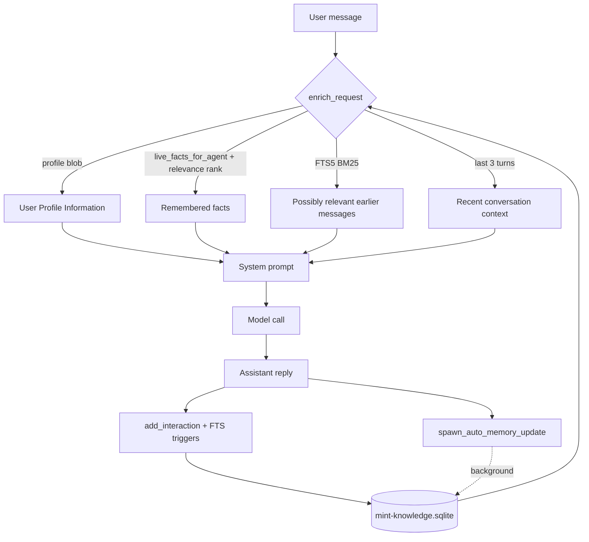

# Mint Agent Memory Architecture

How Mint remembers things across turns, sessions, and surfaces (CLI, desktop,
web) — and how those pieces fit together into what you could reasonably call an
*agentic memory*.

Everything here is **local-first and in-repo**. There is no Mem0, Letta, Zep, or
any external memory service. The whole thing is a single SQLite file plus a few
plain-text folders, assembled into the prompt on every turn by Rust code in
`mint-core`. This was a deliberate call: those frameworks are Python/DB-server
dependencies that clash with Mint's `npm` + build-from-source distribution, and
they target chatbot memory rather than coding-agent memory.

---

## 1. Where it all lives

| Path | What |
|---|---|
| `~/.config/mint/mint-knowledge.sqlite` | The knowledge database — every structured memory (see §2). `chmod 0600` because it also holds OAuth tokens. |
| `~/.config/mint/mint-skills/` | Global skills (`.md` files), available in every workspace. |
| `~/.config/mint/notes/` | Free-form notes the agent writes with the `note_write` tool. |
| `~/.config/mint/semantic-code/<hash>.json` | Per-workspace semantic code index (embeddings). One file per workspace path. |
| `<workspace>/.agents/skills/` | Workspace-local skills, committed with the repo. Also `<workspace>/skills/`. |
| `<workspace>/.agents/AGENTS.md`, `<workspace>/AGENTS.md` | Project rules, loaded as a pseudo-skill. |
| `<linked-folder>/mint-notes/<date>.md` | Auto-notes appended into folders you've linked with `/link`. |
| `~/.config/mint/mint-chat-history.json` | *Legacy.* Migrated into SQLite once on first run, then ignored. |

`dirs::config_dir()` resolves `~/.config/mint` on Linux and the platform
equivalent elsewhere. See `memory_path()` in
`crates/mint-core/src/agent/memory.rs`.

---

## 2. The knowledge database

One SQLite file, opened by two stores:

- **`MemoryStore`** (`crates/mint-core/src/agent/memory.rs`) — conversation
  history, profile, facts, skills, workspace sessions.
- **`KnowledgeStore`** (`crates/mint-core/src/search/knowledge.rs`) — indexed
  documents (`sources` + `chunks`). Same file, different tables.

`journal_mode=WAL` + a 5 s `busy_timeout` so the CLI, `mint gateway`, and the
desktop app can all read/write it concurrently without `SQLITE_BUSY`.

### 2.1 `interaction_memories` — raw turn log

Every user⇄assistant turn, one row: `chat_id`, `user_text`, `ai_text`,
`provider`, `model`, `fallback_provider`, `created_at`, and
`agent_activity_json` (the tool-call trajectory for that turn, if any).

`chat_id` partitions history into conversations. Two are built in:

- `"cli"` — the shared terminal conversation. **Never** scoped by workspace or
  any UI selection (that was tried, it fragmented the one conversation that's
  meant to stay continuous, and it's now a hard-disabled passthrough —
  `scoped_chat_id`). It also can't be deleted through the normal delete path.
- `"conversation-default"` — the default for the typed-chat API.

Scheduled tasks and subagents get their own ids (`cli::subagent::<name>`, etc.).

### 2.2 `interaction_fts` — full-text recall index

An FTS5 external-content table mirroring `interaction_memories`, kept in sync by
`INSERT`/`UPDATE`/`DELETE` triggers. `tokenize='trigram'` so it matches
substrings **and** works for Thai (which has no spaces between words). Ranked
with BM25.

`fts_match_query()` turns arbitrary user text into a safe `MATCH` string: pull
out alphanumeric runs of ≥3 chars (Unicode-aware), lowercase, dedupe, cap at 12,
quote each as a literal, `OR`-join. A `"` can't appear in a token, so FTS
operator injection is impossible.

A one-time `'rebuild'` backfills rows that predate the index, gated by the
`interaction_fts_backfilled` sentinel in `user_profile`.

### 2.3 `facts` — durable, structured memory

The part that makes this feel *agentic* rather than just a transcript. Each row:

| Column | Meaning |
|---|---|
| `scope` | `user` / `preference` (global, always injected) or `project` (only injected when the active workspace matches `project_path`). |
| `project_path` | Set for `project`-scope facts; `NULL` otherwise. |
| `body` | One concise sentence. |
| `agent_id` | `NULL` = shared / user-authored, injected everywhere. `Some(name)` = **quarantined** to a subagent — injected only when that subagent runs again, until promoted. |
| `embedding` | Little-endian `f32` blob — the offline hash embedding of `body` (see §7), for relevance-ranked recall. |
| `source_chat_id`, `source_interaction_id` | Provenance — which turn produced it. |
| `superseded_by` | `NULL` = live. An id = replaced by that fact. `-1` = plainly retracted. |
| `created_at` / `updated_at` | `updated_at` is bumped by a trigger on any content change. |

Two indexes matter:

- `idx_facts_live` — partial index on `(scope, project_path) WHERE superseded_by
  IS NULL`, for the hot "give me the live facts" query.
- `idx_facts_dedup` — **unique** partial index on `(scope, ifnull(project_path,
  ''), ifnull(agent_id, ''), body) WHERE superseded_by IS NULL`. Combined with
  `ON CONFLICT DO NOTHING` in `add_fact`, an identical live fact silently no-ops
  (a subagent's quarantined fact and an identical shared one may still coexist).
  This is the backstop against a chatty background writer flooding the table.

**Injection budget.** `render_memory_facts` caps the injected block at
`MAX_FACTS_CHARS` (1500). Under budget it emits every visible fact, newest
first. Over budget it keeps the `FACT_RECENCY_KEEP` (5) newest, then fills the
rest by cosine similarity of each remaining fact's embedding to the current
message — so a highly relevant older fact beats an irrelevant newer one. With
`config.semantic_fact_recall` off (`/factrecall`), the fill is plain
newest-first, as before.

**Per-agent scoping.** `live_facts_for_agent(project, agent_id)` returns shared
facts (`agent_id IS NULL`) plus, when `agent_id = Some(name)`, that subagent's
own. The main conversation only ever sees shared facts. A quarantined fact is
promoted to shared by `/memory promote <id>`, or automatically inside
`apply_fact_ops` when the main agent adds something whose embedding is ≥
`FACT_PROMOTE_SIMILARITY` (0.82) to an existing quarantined fact — the
subagent's row is promoted (keeping its provenance) instead of a near-duplicate
being inserted.

API: `add_fact` / `add_fact_for_agent`, `live_facts` / `live_facts_for_agent`,
`live_facts_with_embedding`, `quarantined_facts`, `list_facts`,
`supersede_fact`, `promote_fact`, `forget_fact`.

### 2.4 `user_profile` — key/value bag

`name`, `preferences` (a consolidated free-text blob, capped at
`MAX_PREFERENCES_CHARS` = 2500), migration sentinels, and OAuth tokens. The
name + preferences are injected on every turn as "User Profile Information".

### 2.5 `chat_sessions` — conversation list

`id`, `title` (auto-derived from the first user message, or set explicitly for
scheduled tasks), `kind` (`cli` / `conversation`), timestamps. Powers the
sidebar / `/memory list`.

### 2.6 `workspace_sessions` — per-project "where we left off"

One row per workspace path: a `summary` and `verification` string from the last
agent run there. Injected when you return to that workspace so a fresh session
knows the recent state of the project.

### 2.7 `learned_skills` — imported skills

`name`, `source_path` (unique), `content`, timestamps. Populated by `/learn` and
by automatic skill-writing (§4.3). Filesystem skills (`~/.config/mint/mint-skills/`,
`<workspace>/.agents/skills/`) are merged in at read time — see §5.

### 2.8 `sources` + `chunks` — document knowledge base

`KnowledgeStore`. A `source` is an indexed file (`path`, `name`, content
`hash`, `last_indexed`); `chunks` are ~1000-char windows with 200-char overlap,
each stored with an `embedding` BLOB. Search is cosine similarity over the query
embedding.

> **Note:** the embedding here is a deterministic feature-hash (bag-of-tokens
> projected into a fixed vector), **not** a learned semantic model. It behaves
> like smarter keyword matching, not true paraphrase-aware retrieval. Legacy
> chunks with a `NULL` embedding fall back to hashing the text at query time.

---

## 3. What gets injected into every turn

`enrich_request` in `crates/mint-core/src/orchestration/mod.rs` (and its twin
`append_memory_context` for the agent loop / Gemini Live bridge) build the
system prompt in this order:

```
<base system prompt>

User Profile Information:
  User Name: ...
  User Preferences & Profile: ...

Remembered facts:
  - <facts visible to this agent; over budget, ranked by relevance to the message>

Possibly relevant earlier messages (from this conversation's history):
  User: ...      ← FTS5 recall, only if config.memory_recall
  Assistant: ...

[Active Environment Context]
  You are running on: <provider>
  Using AI Model: <model>

Recent conversation context:
  User: ...      ← last CONTEXT_LIMIT (3) turns, verbatim, each capped
  Assistant: ...    at MAX_CONTEXT_MESSAGE_CHARS (200)
```

Budgets are enforced independently: profile 2500 chars, facts 1500, recall 1500,
recent turns 3 × 200. Nothing here can crowd out the actual task.



---

## 4. Automatic background writers

After a turn returns, `spawn_auto_memory_update` fires a detached `tokio` task
(it never blocks or fails the reply). It runs up to two LLM passes:

### 4.1 Profile consolidation — `auto_extract_and_update_memory`

Always runs. Asks a model to fold anything new from this turn into the `name` /
`preferences` values, **rewriting the whole list each time** (merge duplicates,
drop contradicted items, stay under budget) rather than appending. This is why
`preferences` stays a tight summary instead of an ever-growing log.

### 4.2 Fact extraction — `auto_extract_facts` *(new)*

Gated by `config.auto_fact_extraction` (default on) **and** a cheap no-LLM
pre-filter, `looks_fact_worthy`: the user message must contain a durable-info
marker (EN + TH: `prefer`, `always`, `from now on`, `call me`, `ชอบ`,
`เรียกฉันว่า`, `จำไว้`, `อย่า`, …) and be ≥15 chars. Only qualifying turns pay
for the extra call.

When it runs, it shows the model the current live facts as
`- [id 12] (user) prefers TypeScript` and asks for an op list:

```json
{"ops": [
  {"op": "add", "scope": "user", "body": "one concise sentence"},
  {"op": "supersede", "id": 12, "replacement": "one concise sentence"}
]}
```

`apply_fact_ops` applies them defensively (it's pure and unit-tested against a
temp DB):

- at most `MAX_FACT_OPS_PER_TURN` (3) ops per turn;
- ownership follows the source chat id: a `…::subagent::<name>` turn quarantines
  every added fact to `<name>`; an ordinary turn adds shared facts;
- `add` (main agent): before inserting, checks the quarantined facts — if one is
  ≥ `FACT_PROMOTE_SIMILARITY` (0.82) by embedding cosine, that row is **promoted**
  and no new row is written;
- `add`: `scope` must be valid; a `project` op with no active workspace is
  **skipped**, not downgraded; the dedup index absorbs exact repeats;
- `supersede`: the `id` must be one that was actually shown to the model
  (invented ids are rejected); the replacement is re-filed under the superseded
  fact's own scope / workspace / owner;
- the "stored facts" list shown to the model is scoped with
  `live_facts_for_agent`, so a subagent reasons over its own quarantined facts
  plus the shared pool — never another subagent's;
- once the live-fact count passes `FACTS_CONSOLIDATE_THRESHOLD` (40), the prompt
  switches to "prefer merging/superseding over adding".

Toggle: `/autofacts [on|off]`.

### 4.3 Skill writing — `auto_write_skill`

Gated by `config.auto_skill_writing` (default on) and `looks_skill_worthy` (the
task took ≥3 steps and did real work — edits, shell, browser, subagent). Asks a
model whether the finished task generalizes into a reusable skill, and if so
writes / refines `<workspace>/.agents/skills/<slug>/SKILL.md` with a bumped
`revisions:` count. Toggle: `/autoskill [on|off]`.

### 4.4 Linked-folder notes — `spawn_linked_folder_note`

If you've `/link`ed folders, a model decides whether the turn is on-topic for
one of them and, if so, appends a dated note to
`<folder>/mint-notes/<date>.md`, cross-linking related existing notes by id.

---

## 5. Skills as memory

`learned_skills_context` (`crates/mint-core/src/agent/skills.rs`) merges, per
turn:

1. `learned_skills` table rows (from `/learn` + auto-writing);
2. global skills in `~/.config/mint/mint-skills/`;
3. global `~/.gemini/config/AGENTS.md`;
4. workspace skills in `<workspace>/.agents/skills/` and `<workspace>/skills/`;
5. workspace `AGENTS.md` files.

De-duped by name. Global/taught skills are injected **in full**. Workspace
skills are injected as a `Path + Description + Status` pointer (`UNREAD` /
`READ`) to save context budget — the agent `read_file`s the body only when it
actually needs it, and only once per conversation.

---

## 6. Two ways to recall old messages

| | Automatic recall | The `memory_recall` tool |
|---|---|---|
| Trigger | Every turn, if `config.memory_recall` (`/autorecall`) | Agent chooses to call it |
| Method | FTS5 + BM25 (`recall_interactions`) | Naive `contains` scan over the last 50 turns + learned skills |
| Scope | Current `chat_id`, skips the `CONTEXT_LIMIT` newest turns (already injected) | Current `chat_id` |
| Output | "Possibly relevant earlier messages" block, ≤`MAX_RECALL_CHARS` | Tool result text |
| Code | `render_recalled_messages` in `orchestration/memory_skill.rs` | `tools/misc.rs` |

The automatic path is the good one. The tool path is a coarse fallback the agent
can reach for explicitly ("what did the user say about X earlier").

---

## 7. The offline embedding (`search/text_embedding.rs`)

A single dependency-free, deterministic **feature-hash** embedding
(`embedding()`, 256-dim, L2-normalized so a dot product is a cosine). Every
alphanumeric token — Unicode-aware, so Thai contributes — is hashed into a
bucket with a ±1 sign. Quality is "smart keyword matching": it captures shared
vocabulary and substrings, not true paraphrase. No model, no API key, no
network.

Shared by the document `chunks` (§2.8) and by `facts` relevance ranking (§2.3).
`FactEmbeddingBackend` is the seam where a learned backend (e.g.
`gemini-embedding-001`) could be dropped in later — new enum variant + one
branch in `fact_embedding_backend()`, with the stored blob format unchanged (a
blob of the wrong width for the active backend is simply recomputed on read).

## 7a. Adjacent stores

- **Semantic code index** (`crates/mint-core/src/search/semantic.rs`) — per
  workspace, `~/.config/mint/semantic-code/<hash>.json`. Indexes `.rs/.js/.jsx/
  .ts/.tsx/.py` files. Uses a **real** embedding model (`gemini-embedding-001`,
  needs a Gemini API key) + cosine similarity — this is the semantically-aware
  retriever, scoped to code. (The `facts` table deliberately does *not* use this
  — see §10.)
- **Document knowledge base** (§2.8) — `/knowledge`-style document Q&A over
  indexed files.

---

## 8. Context compaction

Separate from long-term memory but related: once a running agent conversation
approaches `COMPACTION_TRIGGER_RATIO` (0.75) of the model's context window,
`compact_native_messages` summarizes the older `[Assistant, Tool]` step-pairs
into one synthetic pair and keeps the last `COMPACTION_KEEP_RECENT_STEPS` (3)
verbatim. Cutting only on pair boundaries keeps role alternation valid for every
provider. This shrinks *in-flight* history; it does not touch what's in SQLite.

`context_window_tokens()` is what compaction measures against — 200K for
Anthropic, model-string-keyed for OpenAI, `ollama_num_ctx` for Ollama, etc.

---

## 9. Config & slash-command reference

| Flag (`MintConfig`) | Default | Slash command | Controls |
|---|---|---|---|
| `memory_recall` | `true` | `/autorecall [on\|off]` | FTS5 recall injection each turn |
| `auto_fact_extraction` | `true` | `/autofacts [on\|off]` | Background fact extraction into `facts` |
| `semantic_fact_recall` | `true` | `/factrecall [on\|off]` | Relevance-rank facts (vs newest-first) when they overflow the budget |
| `auto_skill_writing` | `true` | `/autoskill [on\|off]` | Background `SKILL.md` writing |

Manual memory commands:

| Command | Action |
|---|---|
| `/remember <text>` | Add a `user`-scope fact |
| `/remember here <text>` | Add a `project`-scope fact pinned to this workspace |
| `/memory facts` | List stored facts (with `global` / `project` / `via <subagent>` owner) |
| `/memory forget <id-or-text>` | Delete fact(s) by id or substring |
| `/memory promote <id>` | Lift a subagent-scoped fact into shared memory |
| `/memory list` | Recent interactions |
| `/memory get <key>` / `/memory set <key> <value>` | Read / write a `user_profile` value |
| `/memory clear` | Clear interactions for the current conversation |
| `/link` | Link a folder for auto-notes |

The slash catalog is authored once in `slash-commands.json` at the repo root and
read by every surface; the CLI has its own dispatcher in
`crates/mint-cli/src/interactive/slash_commands.rs` that must carry a matching
arm (`dispatcher_tokens_are_documented` guards this).

---

## 10. Design principles

1. **Local-first, single file.** Everything portable in one `.sqlite` you can
   copy, inspect with `sqlite3`, or delete. No daemon, no network hop.
2. **Injected, not retrieved-on-demand.** The highest-signal memory (profile,
   live facts, recent turns) rides *every* prompt with a fixed budget. The agent
   doesn't have to know to ask.
3. **Bounded by construction.** Every injected block has a hard char cap and a
   drop policy. Memory can't degrade latency or crowd out the task over time.
4. **Self-consolidating.** Both the profile blob and the facts table are
   rewritten/superseded by background passes, not append-only. A dedup index is
   the last line of defense.
5. **Cheap gates before expensive calls.** `looks_fact_worthy` /
   `looks_skill_worthy` are keyword/step-count filters that keep the extra LLM
   passes off the turns that don't need them.
6. **Fire-and-forget writes.** No background memory task can slow down or fail a
   user-visible reply.
7. **Provenance.** Facts carry `source_chat_id` / `source_interaction_id` /
   `agent_id`; notes cross-link by id; skills carry a `revisions:` count.
8. **One embedding, in the same file.** Fact relevance ranking is brute-force
   cosine over a hash embedding stored as a `BLOB` column — no vector DB, no
   cross-store round-trip, no ops. A real learned backend can replace the hash
   without touching the schema or the recall code (§7).

---

## 11. Where this could go

Grounded next steps, roughly in value order:

- **A real embedding backend for facts.** The `FactEmbeddingBackend` seam is in
  place; a learned model (local, or `gemini-embedding-001` behind a flag) would
  lift fact recall from "keyword-plus" to genuine paraphrase matching. The hash
  embedding stays the offline default and the dim-mismatch fallback.
- **Fact decay / periodic consolidation.** A scheduled pass that merges
  near-duplicate facts and retires stale ones — the same treatment the
  `preferences` blob already gets, applied to the structured table. Would pair
  well with a `last_used_at` / hit counter for usage-weighted retention.
- **Entity/relation layer.** A lightweight `(subject, relation, object)` graph on
  top of `facts` for questions like "what depends on X". Only worth it once a
  real use case shows up — for a coding agent it's easy to over-build.
- **Shared team memory.** The DB is already multi-writer within one machine, and
  facts now carry an `agent_id` scope. A sync layer (CRDT or a server) would let
  a team share `project`-scope facts for a repo.
- **LLM-scored fact confidence.** Store a confidence with each extracted fact and
  weight injection / supersession by it, so a tentative "I think I prefer…" is
  held more loosely than "always do X".

*Shipped since the first draft of this doc:* automatic fact extraction
(`/autofacts`), relevance-ranked fact recall (`/factrecall`), per-subagent fact
scoping with promotion (`/memory promote`).

---

*Primary source files:* `crates/mint-core/src/agent/memory.rs`,
`crates/mint-core/src/orchestration/memory_skill.rs`,
`crates/mint-core/src/orchestration/mod.rs`,
`crates/mint-core/src/agent/skills.rs`,
`crates/mint-core/src/search/{knowledge,semantic,text_embedding,linked_folders}.rs`,
`crates/mint-core/src/orchestration/tools/misc.rs`.
